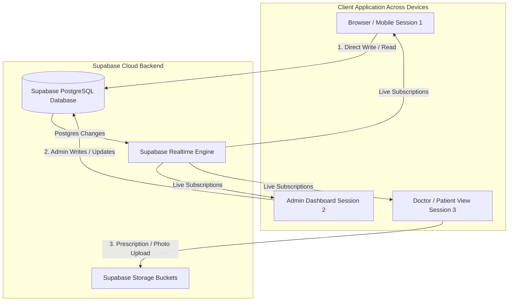

# Centralized Supabase Architecture & Live Realtime Synchronization

This document details the centralized Supabase database architecture, live Realtime synchronization implementation across devices and sessions, storage buckets setup for doctor profile images & patient prescriptions, and RLS security policies.

---

## 🏛️ System Architecture Overview

---

## 🛠️ Key Changes Implemented

### 1. Centralized Supabase PostgreSQL Schema
- **`clinicians` Table**: Stores doctor profiles, titles, qualifications, and Storage photo CDN URLs.
- **`patient_records` Table**: Stores all patient appointments, contact information, consultation status, and associated medical reports.
- **`patient_reports` Table**: Central metadata table for uploaded prescriptions, lab reports, and diagnosis documents.
- **`medicine_orders` Table**: Stores online pharmacy medicine orders and courier tracking updates.
- **`admin_users` Table**: Stores authorized admin login credentials and role permissions.

### 2. Live Supabase Realtime Synchronization
- Enabled Postgres Replication (`ALTER PUBLICATION supabase_realtime ADD TABLE ...`).
- Integrated `subscribeToCliniciansRealtime`, `subscribeToPatientRecordsRealtime`, and `subscribeToMedicineOrdersRealtime` in `clinician-service.ts`, `patient-service.ts`, `order-service.ts`, `About.tsx`, and `admin-dashboard.tsx`.
- All `INSERT`, `UPDATE`, and `DELETE` operations broadcast live postgres changes directly to all open browser windows, tabs, and devices without page reloads.

### 3. Supabase Storage Buckets
- Created buckets:
  - `doctor-profile-images` / `clinician-photos` for doctor profile pictures.
  - `prescriptions` / `patient-reports` for patient prescription uploads and camera snapshots.
- Added strict file validation in `UploadReportModal.tsx`:
  - Allowed MIME types: `image/jpeg`, `image/png`, `image/webp`, `application/pdf`.
  - Max file size limit: **10MB**.

### 4. Security & Row Level Security (RLS)
- Enabled RLS on all database tables (`clinicians`, `patient_records`, `patient_reports`, `medicine_orders`, `admin_users`).
- Storage object policies configure public read access and controlled upload/update permissions.

---

## 📜 SQL Migration Files Created

1. **`supabase-schema.sql`** (Root file for execution in Supabase SQL Editor)
2. **`supabase/migrations/20260907000000_init_centralized_schema.sql`** (Supabase CLI Migration file)

---

## ⚙️ One-Time Supabase Dashboard Setup Instructions

1. Log into your [Supabase Dashboard](https://app.supabase.com).
2. Select your project: **`Yours-Clinic`**.
3. Go to **SQL Editor** (`/project/_/sql`).
4. Click **New Query**, paste the contents of `supabase-schema.sql`, and click **Run**.
5. Go to **Database → Realtime** (`/project/_/database/publications`) and verify that `supabase_realtime` is active for:
   - `public.clinicians`
   - `public.patient_records`
   - `public.patient_reports`
   - `public.medicine_orders`
6. Go to **Storage → Buckets** (`/project/_/storage/buckets`) and verify that the following buckets exist and are marked as Public:
   - `doctor-profile-images`
   - `clinician-photos`
   - `prescriptions`
   - `patient-reports`
